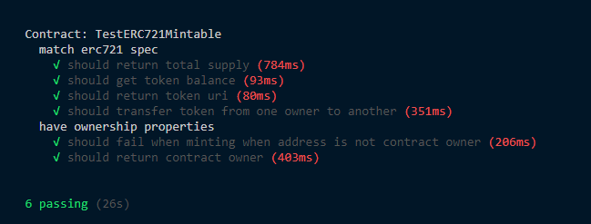
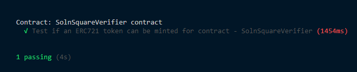
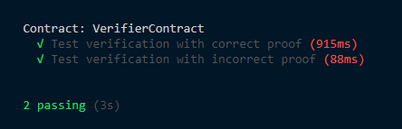
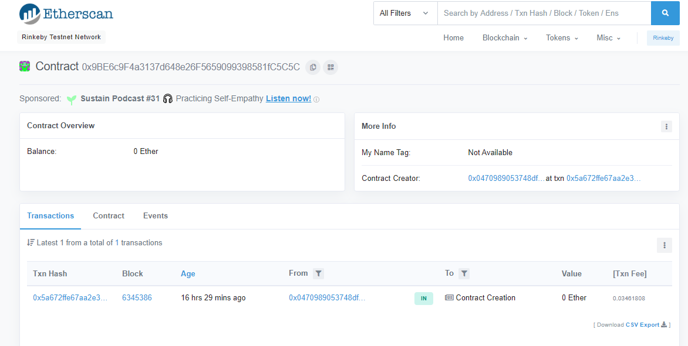
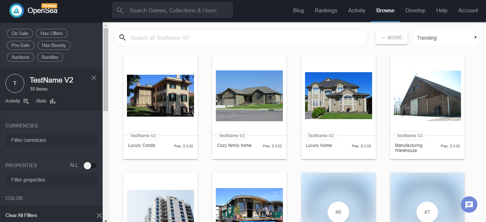

# Udacity Blockchain Capstone

a project of decentralized housing product used to list your property tokens for sale in the Opensea decentralized marketplace.This project was implemented with zkSnarks using ZoKrates, a toolbox for zkSNARKs on Ethereum to create a verification system which can prove you have title to the property without revealing that specific information on the property.

## Token Info

-   Token Name: `TestName`.
-   Token Abbreviation: `TN`.

## Contract Addresses

-   Contract Address: `0x9BE6c9F4a3137d648e26F5659099398581fC5C5C`.
-   Contract Link (Rinkeby - etherscan): https://rinkeby.etherscan.io/address/0x9BE6c9F4a3137d648e26F5659099398581fC5C5C.

## Contract ABI

It is in `eth-contracts/build/contracts` directory of this project.

## OpenSea MarketPlace Storefront links

-   Link to OpenSea MarketPlace Storefront: https://rinkeby.opensea.io/assets/testname-v2-1.
-   Link to the owner account : https://rinkeby.opensea.io/accounts/0x0470989053748dff261e81fae29b7234a3607258.
-   Link to the buyer account: https://rinkeby.opensea.io/accounts/0x43d92399ae806fda4e45402eab926d06d2a707b3.

## Testing

1. `ganache-cli -m ${mnemonic} -a 20`.
2. Be sure you are in /eth-contract/ directory .. `cd eth-contracts/`.
3. `truffle test ./test/TestERC721Mintable.js`.
4. `truffle test ./test/TestSolnSquareVerifier.js`.
5. `truffle test ./test/TestSquareVerifier.js`.

## Minting 10 tokens

I used `./eth-contracts/scripts/mint.js` file to mint 10 tokens to the rinkeby network and I used proofs that I got from implementing square.code file by Zokrates.

```bash
Minted creature. Transaction: 0xb5d3238f3ffb499365c8df6453cdd373279e72b1befbd2d89476a6302b9cf850
Minted creature. Transaction: 0x8bc6fa36a950fc86d6ad1902918ec3b5d4f474563aa59c0ab335724e97398834
Minted creature. Transaction: 0xe2f5a34fdfdfa88bcb6470ca0172cbae85dd0e99fc9edacc51d884903bc5c3a2
Minted creature. Transaction: 0x312866ab3829fb57cc5441076ec35e3999e8bb6461a1c716bc8a69673eae161b
Minted creature. Transaction: 0x827c3c34673831e5391208c8629625bc8c1cf2d3b0d5486fba2fcd927b7b2c27
Minted creature. Transaction: 0xabf3b4e4669546b7aacf69d6b3c01d2a6d0b3fa31b3d0385d2df4a6c2ec87bfb
Minted creature. Transaction: 0x47bfdcc90f0b1a2bed5f6b39a597282527e91749a9ed3364fb6be939f4440219
Minted creature. Transaction: 0x8e07f1d4e81afc0dce1d365969c365699f8d93c8c3669466ce0a12815c1b6ee5
Minted creature. Transaction: 0xc9bd1f0776ee5ecc47b3144006ab789dea04759427ab97751981ed25e7c5bab7
Minted creature. Transaction: 0xc7019d6ec1ce2984cf5faf210ec236df46e7de207ab2bfca52a3973757f35818
```

## Screenshots of implementing the project







## Tools and Enivroments Versions

-   Truffle v5.1.22.
-   node v13.2.0.
-   Solidity: v0.5.2 (solc-js).
-   Docker version 19.03.8, build afacb8b
-   Host OS: Windows 10 Pro 64-bit (10.0, Build 17763).
